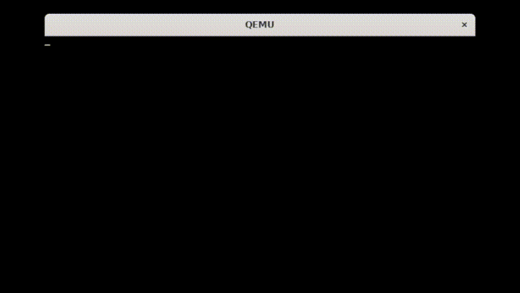

# ☢️ Kernel From Scratch (KFS)

The main goal of this project is to implement a 32 bits operating system from scratch!



## ✨ Features
### 💪 Basic (feat)ures

- ⚓ An ASM boot code that loads the kernel using GRUB
- 📚 A minimal libc written in C
- ⚛️ A kernel written in C
- 🖵 A basic VGA display

### 🎁 Bonus features

- 🌈 Color support
- 🎬 A bootscreen with an animated 42 logo!
- 🖵 Multiscreen support
- 📶 On-screen status bar
- ⌨️ Keyboard support with shortcuts (US layout)
- ✏️ A minimal line editor
- 🔖 Some advanced printing functions like printf

## 🔑 Controls
### ⌨️ Keyboard Shortcuts

| Action | Shortcut |
| --- | --- |
| Clear the screen | Ctrl + L |
| Erase the current line | Ctrl + U |
| Scroll down | Down |
| Scroll page down | Page Down |
| Switch to the next screen | Ctrl + Right |
| Switch to the previous screen | Ctrl + Left |

## 📦 Prerequisites

- [Docker Compose](https://docs.docker.com/compose)
- [GNU Make](https://www.gnu.org/software/make)
- [QEMU](https://www.qemu.org)

## 🚀 Usage

Here is a simple example of how to build and run the project:
```sh
make run
```

- ⚠️ **Warning**: The docker image can take a long time to build the first time.

## 🗒️ Documentation

The kernel is documented using Doxygen.
The documentation is available [here](https://chuokupai.github.io/kfs).

## ⚖️ License

This project is licensed under the GNU General Public License v3.0 - see the [LICENSE](LICENSE) file for details.

## 📚 Resources

- [Bran's Kernel Development Tutorial](http://www.osdever.net/bkerndev/Docs/title.htm)
- [The little book about OS development](https://littleosbook.github.io)
- [The wiki of OSDev](https://wiki.osdev.org/Expanded_Main_Page)
